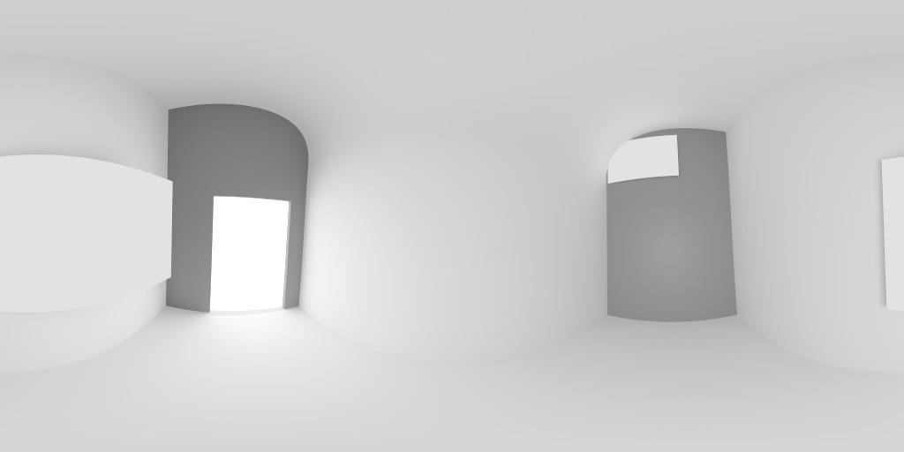
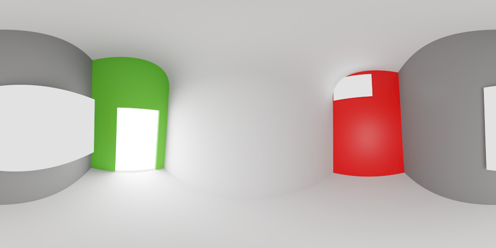

Sample environments for the glTF 2.0 Sample Viewer
==================================================

These are the environments used for image-based lighting (IBL) in the official [glTF 2.0 Sample Viewer](https://github.com/KhronosGroup/glTF-Sample-Viewer). It is used as a sub-module from the previous repository.  


Sampling the panorama images
----------------------------

The normalized scan vector `scanVector` is used to calculate the sample location `sampleLocation`:

```
	sampleLocation.s = 0.5 + 0.5 * atan(scanVector.z, scanVector.x) / UX3D_MATH_PI;
	sampleLocation.t = 1.0 - acos(scanVector.y) / UX3D_MATH_PI;
```

The scan vector is using the same [coordinate system as glTF 2.0](https://github.com/KhronosGroup/glTF/tree/master/specification/2.0#coordinate-system-and-units). The above GLSL snippet can either be used to generate a cube map or to directly sample the texels. The following code snippets is using the first approach.  
  
Prefiltering Diffuse Images
---------------------------
  
```
#version 450 core

#define UX3D_MATH_PI 3.1415926535897932384626433832795
#define UX3D_MATH_INV_PI (1.0 / 3.1415926535897932384626433832795)

#define UX3D_MATH_TWO_PI (2.0 * UX3D_MATH_PI)
#define UX3D_MATH_HALF_PI (0.5 * UX3D_MATH_PI)

layout(push_constant, std140) uniform _u_parameter {
    layout(offset = 64) uint samples;
    uint padding;
} u_parameter;

layout (binding = 0) uniform samplerCube u_cubeMap;

layout (location = 0) in vec3 v_normal;

layout (location = 0) out vec4 ob_fragColor;

vec2 randomHammersley(uint i, uint n)
{
    return vec2(float(i) / float(n), bitfieldReverse(i) * 2.3283064365386963e-10);
}

vec3 renderGetLambertWeightedVector(vec2 e, vec3 normal)
{
    float phi = 2.0 * UX3D_MATH_PI * e.y;
    float cosTheta = 1.0 - e.x;
    float sinTheta = sqrt(1.0 - cosTheta*cosTheta);

    // Note: Polar Coordinates
    // x = sin(theta)*cos(phi)
    // y = sin(theta)*sin(phi)
    // z = cos(theta)

    vec3 H = normalize(vec3(sinTheta * cos(phi), sinTheta * sin(phi), cosTheta));
    
    //
    
    vec3 bitangent = vec3(0.0, 1.0, 0.0);

    float NdotB = dot(normal, bitangent);

    if (NdotB == 1.0)
    {
        bitangent = vec3(0.0, 0.0, -1.0);
    }
    else if (NdotB == -1.0)
    {
        bitangent = vec3(0.0, 0.0, 1.0);
    }

    vec3 tangent = cross(bitangent, normal);
    bitangent = cross(normal, tangent);
    
    //
    
    return normalize(tangent * H.x + bitangent * H.y + normal * H.z);
}

vec4 renderLambert(vec2 randomPoint, vec3 N)
{
    vec3 H = renderGetLambertWeightedVector(randomPoint, N);
    
    // Note: reflect takes incident vector.
    // Note: N = V
    vec3 V = N;

    vec3 L = normalize(reflect(-V, H));
        
    float NdotL = dot(N, L);
        
    if (NdotL > 0.0)
    {   
        // Mipmap Filtered Samples 
        // see https://github.com/derkreature/IBLBaker
        // see https://developer.nvidia.com/gpugems/GPUGems3/gpugems3_ch20.html
        
        float cubeWidth = float(textureSize(u_cubeMap, 0).x);

        float pdf = max(NdotL * UX3D_MATH_INV_PI, 0.0);
            
        float solidAngleTexel = 4.0 * UX3D_MATH_PI / (6.0 * cubeWidth * cubeWidth);
        float solidAngleSample = 1.0 / (float(u_parameter.samples) * pdf);
            
        float lod = 0.5 * log2(solidAngleSample / solidAngleTexel);
        
        return vec4(texture(u_cubeMap, H, lod).rgb, 1.0);
    }
    
    return vec4(0.0, 0.0, 0.0, 0.0);
}

void main(void)
{
    vec3 N = normalize(v_normal);

    vec4 colorLambert = vec4(0.0, 0.0, 0.0, 0.0);

    for (uint sampleIndex = 0; sampleIndex < u_parameter.samples; sampleIndex++)
    {
        vec2 randomPoint = randomHammersley(sampleIndex, u_parameter.samples);

        // N = V
        colorLambert += renderLambert(randomPoint, N);
    }
    
    ob_fragColor = vec4(colorLambert.rgb / colorLambert.w, 1.0);
}
```
  
Prefiltering Specular Images
----------------------------
  
```
#version 450 core

#define UX3D_MATH_PI 3.1415926535897932384626433832795
#define UX3D_MATH_INV_PI (1.0 / 3.1415926535897932384626433832795)

layout(push_constant, std140) uniform _u_parameter {
    layout(offset = 64) uint samples;
    float roughness;
} u_parameter;

layout (binding = 0) uniform samplerCube u_cubeMap;

layout (location = 0) in vec3 v_normal;

layout (location = 0) out vec4 ob_fragColor;

vec2 randomHammersley(uint i, uint n)
{
    return vec2(float(i) / float(n), bitfieldReverse(i) * 2.3283064365386963e-10);
}

vec3 renderGetGGXWeightedVector(vec2 e, vec3 normal, float roughness)
{
    float alpha = roughness * roughness;

    float phi = 2.0 * UX3D_MATH_PI * e.y;
    float cosTheta = sqrt((1.0 - e.x) / (1.0 + (alpha*alpha - 1.0) * e.x));
    float sinTheta = sqrt(1.0 - cosTheta*cosTheta);

    // Note: Polar Coordinates
    // x = sin(theta)*cos(phi)
    // y = sin(theta)*sin(phi)
    // z = cos(theta)

	vec3 H = normalize(vec3(sinTheta * cos(phi), sinTheta * sin(phi), cosTheta));
    
    //
    
    vec3 bitangent = vec3(0.0, 1.0, 0.0);

    float NdotB = dot(normal, bitangent);

    if (NdotB == 1.0)
    {
        bitangent = vec3(0.0, 0.0, -1.0);
    }
    else if (NdotB == -1.0)
    {
        bitangent = vec3(0.0, 0.0, 1.0);
    }

    vec3 tangent = cross(bitangent, normal);
    bitangent = cross(normal, tangent);
    
    //
    
	return normalize(tangent * H.x + bitangent * H.y + normal * H.z);
}

float ndfTrowbridgeReitzGGX(float NdotH, float roughness)
{
    float alpha = roughness * roughness;
    
    float alpha2 = alpha * alpha;
    
    float divisor = NdotH * NdotH * (alpha2 - 1.0) + 1.0;
        
    return alpha2 / (UX3D_MATH_PI * divisor * divisor); 
}

vec4 renderCookTorrance(vec2 randomPoint, vec3 N, float roughness)
{
    vec3 H = renderGetGGXWeightedVector(randomPoint, N, roughness);

    // Note: reflect takes incident vector.
    // Note: N = V
    vec3 V = N;
    
    vec3 L = normalize(reflect(-V, H));
    
    float NdotL = dot(N, L);

	if (NdotL > 0.0)
	{
	    float lod = 0.0;
	
	    if (roughness > 0.0)
	    {    
		    // Mipmap Filtered Samples
		    // see https://github.com/derkreature/IBLBaker
		    // see https://developer.nvidia.com/gpugems/GPUGems3/gpugems3_ch20.html
		    
		    float cubeWidth = float(textureSize(u_cubeMap, 0).x);
		
		    float VdotH = dot(V, H);
		    float NdotH = dot(N, H);
		
		    float D = ndfTrowbridgeReitzGGX(NdotH, roughness);
	        float pdf = max(D * NdotH / (4.0 * VdotH), 0.0);
	        
	        float solidAngleTexel = 4.0 * UX3D_MATH_PI / (6.0 * cubeWidth * cubeWidth);
	        float solidAngleSample = 1.0 / (u_parameter.samples * pdf);
	        
	        lod = 0.5 * log2(solidAngleSample / solidAngleTexel);
	    }
	    
	    return vec4(textureLod(u_cubeMap, L, lod).rgb * NdotL, NdotL);
	}
	
	return vec4(0.0, 0.0, 0.0, 0.0);
}

void main(void)
{
    vec3 N = normalize(v_normal);

    vec4 colorCookTorrance = vec4(0.0, 0.0, 0.0, 0.0);

    for (uint sampleIndex = 0; sampleIndex < u_parameter.samples; sampleIndex++)
    {
        vec2 randomPoint = randomHammersley(sampleIndex, u_parameter.samples);

        // N = V
        colorCookTorrance += renderCookTorrance(randomPoint, N, u_parameter.roughness);
    }
    
    ob_fragColor = vec4(colorCookTorrance.rgb / colorCookTorrance.w, 1.0);
}
```
  
Panorama images used for sampling
=================================

doge2
-----  
  
  
ennis
-----
  
  
field
-----
  
  
footprint_court
---------------
  
  
helipad
-------
  
  
papermill
---------
  
  
pisa
----
  

studio_grey
-----------
  
  
studio_red_green
----------------
  
