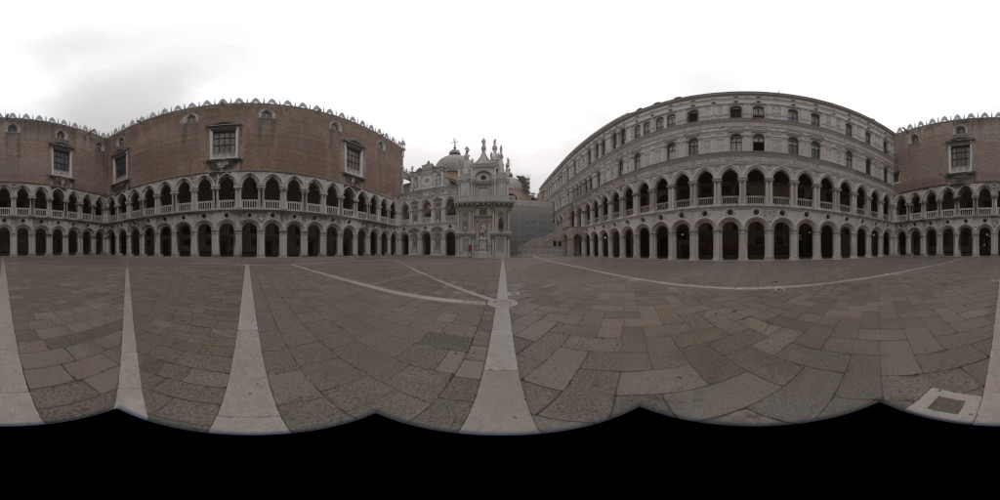
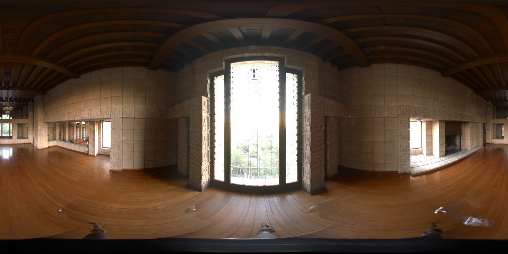
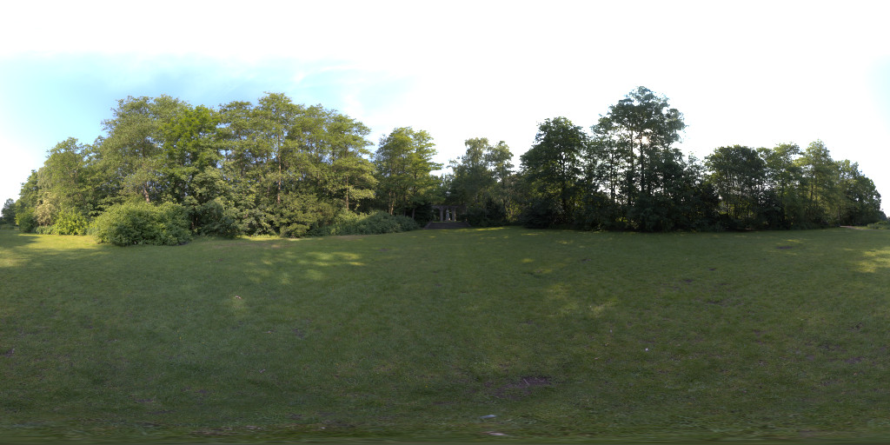
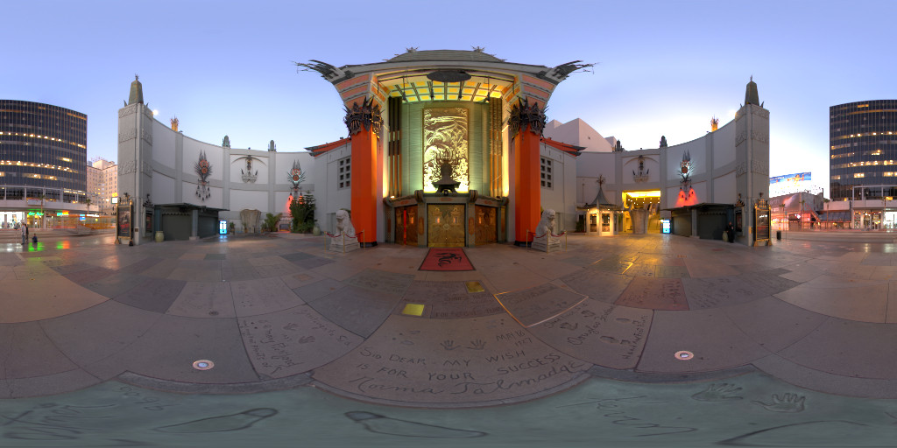
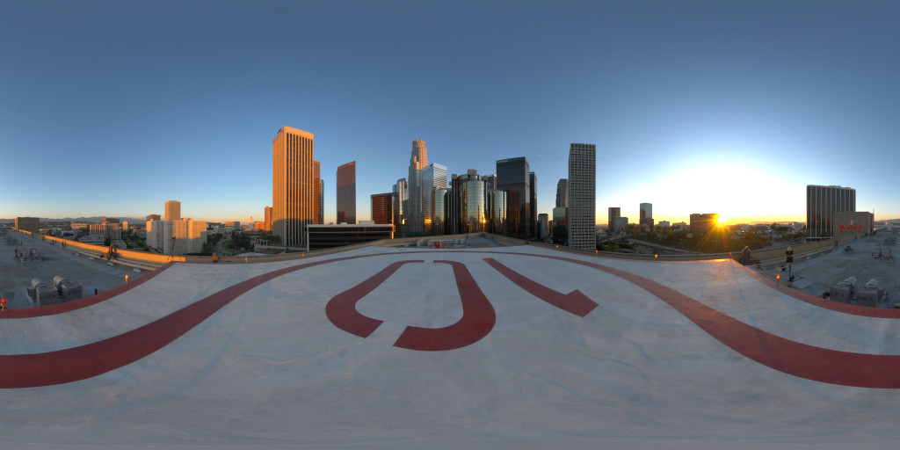
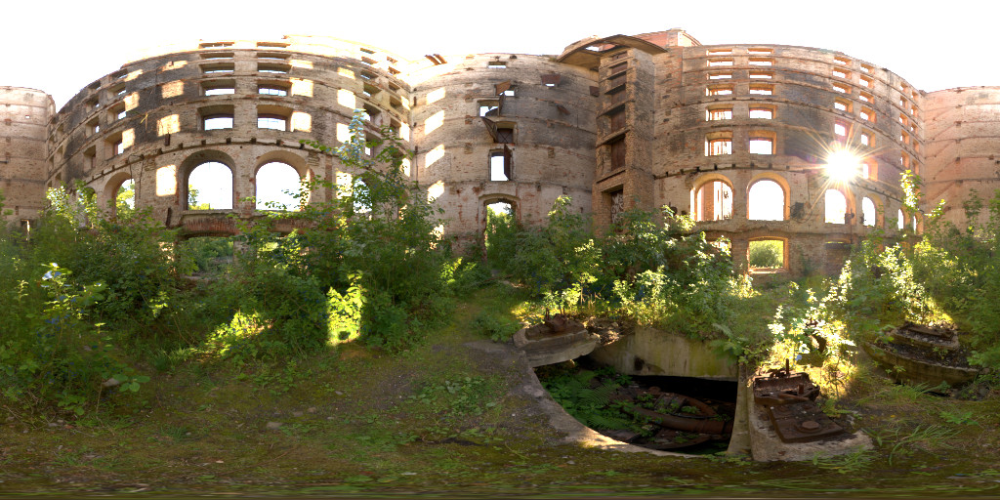
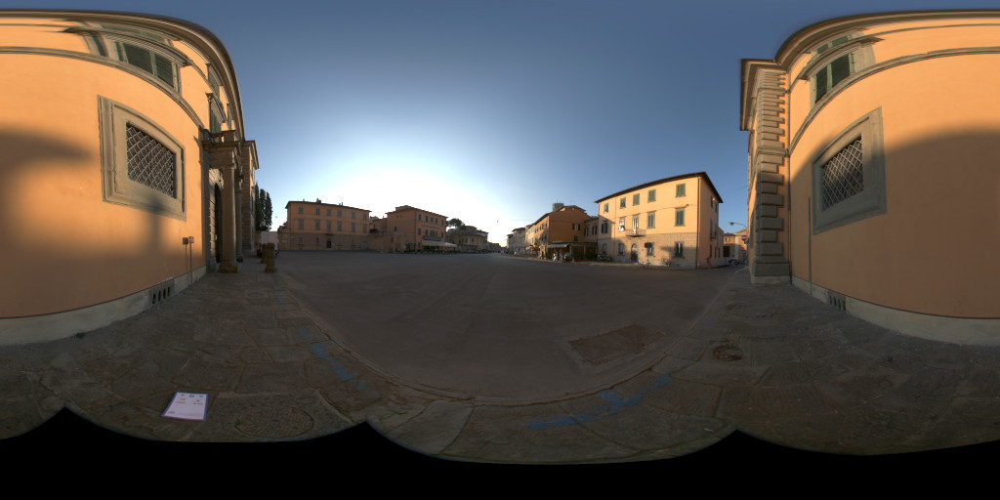
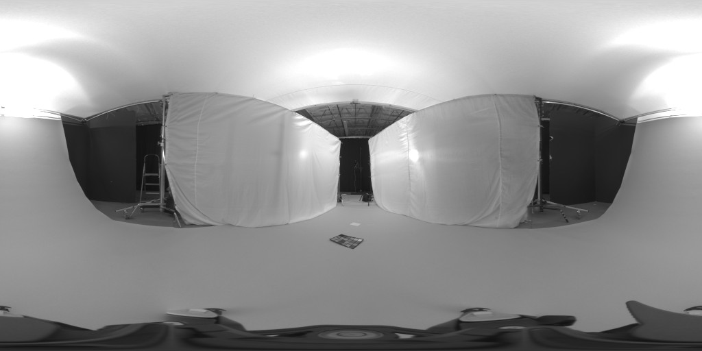
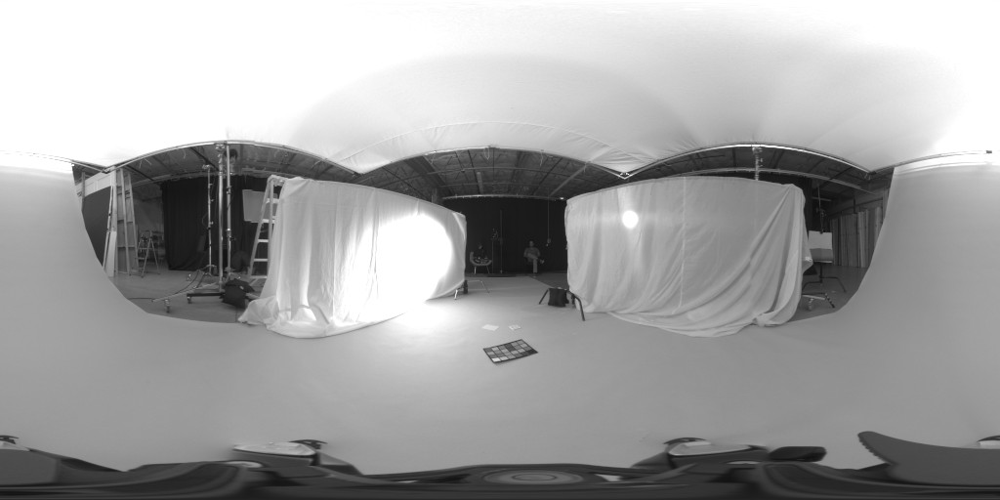
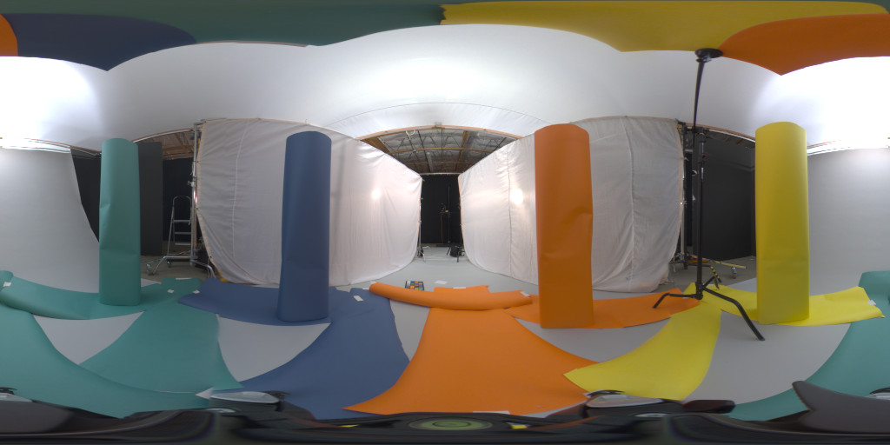

Sample environments for the glTF 2.0 Sample Viewer
==================================================

These are the environments used for image-based lighting (IBL) in the official [glTF 2.0 Sample Viewer](https://github.com/KhronosGroup/glTF-Sample-Viewer). It is used as a sub-module from the glTF sample viewer.  

Sampling the panorama images
----------------------------

The panorama images are prefiltered using the [glTF IBL Sampler](https://github.com/KhronosGroup/glTF-IBL-Sampler).
  
Panorama images used for sampling
=================================
The following images are the JPG versions of the panorama images. The link is guiding to the original file.

[doge2](http://gl.ict.usc.edu/data/highresprobes/)
-----  
  
  
[ennis](http://gl.ict.usc.edu/data/highresprobes/)
-----  
  
  
[field](https://www.hdri-hub.com/hdrishop/freesamples/freehdri/item/116-hdr-040-field-free)
-----  
  
  
[footprint_court](http://www.hdrlabs.com/sibl/archive/)
-----  
  
  
[helipad](http://www.hdrlabs.com/sibl/archive/)
-----  
  
  
[papermill](http://www.hdrlabs.com/sibl/archive/)
-----  
  
  
[pisa](http://gl.ict.usc.edu/data/highresprobes/)
-----  
  

neutral
-----  
  

directional
-----  
  

chromatic
-----  
  
